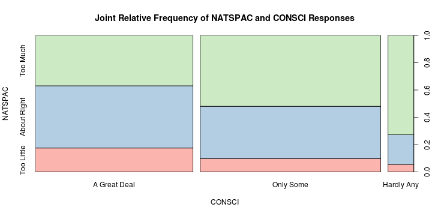

<!-- Make sure that the knitr package is installed and loaded. -->
<!-- For more info on the package options see http://yihui.name/knitr/options -->

<!-- Replace below with the title of your project -->
### Relationship Analysis of "Confidence in the Scientific Community"" and "Space Exploration Funding" 
#### 4 April 2014


<!-- Enter the code required to load your data in the space below. The data will be loaded but the line of code won't show up in your write up (echo=FALSE) in order to save space-->


<!-- In the remainder of the document, add R code chunks as needed -->

### Introduction:

This report will explore the relationship between "confidence in the scientific community" and "space exploration funding".
The relationship between these variables is important to know because understanding what factors influence space exploration funding 
determines what projects can happen (e.g. exploring Mars). At first thought it feels that these two factors are somehow related 
to each other but the purpose of this analysis is to provide a statistical foundation into this relationship rather than just relying
on anecdotal evidence.  

The data for this
report is provided by the General Social Survey (GSS), a yearly survey that measures societal change and the growing complexity of American society.
Participants in the survey are interviewed face-to-face by the National Opinion Research located in the University of Chicago (UC). All participants
are 18 years or older and are from randomly selected households. Due to the nature of the data collection, the GSS is an observational study and
any results can, ideally, be generalized to the US population as a whole. This also means results cannot be used to make causal statements.
There are, however, at least two sources of bias that impede the generalizability
of results. First, the "face-to-face inteviews" performed at UC introduce a "convenience bias" as people who are close to Chicago will be more likely
to participate. Second, the study may also suffer from "voluntary response bias" since people cannot be forced to go to UC and only those with 
strong responses may participate. The dataset used for this report contains the results of 57,000 participants (much less than 10% of US population) 
which will be assumed to be large enough to mitigate the stated sources of bias.

The GSS dataset can be downloaded from [here](http://bit.ly/dasi_gss_data) and information about it can be found [here](https://d396qusza40orc.cloudfront.net/statistics%2Fproject%2Fgss1.html)


### Data:

As stated earlier, the dataset contains the interview responses of about 100 questions from 57,061 participants where each particpant is an 
observation. The two variables (questions) this analysis examines are "confidence in the scientific community" (CONSCI) and
"attitudes towards space exploration spending" (NATSPAC). Both variables are ordinal categorical variables with the former having
three levels: "A Great Deal", "Only Some", and "Hardly Any" and the latter also having three levels: "Too little", "about right", and "too much".
The observations in this dataset will be assumed to be independent (no participants are related).

CONSCI is the explantory variable and NATSCI is the response variable in this analysis.


### Exploratory data analysis:

The two figures below show the distribution of responses for the two variables, individually, being examined in this analysis. Additionally, each 
figure is followed by a table containing the exact counts of each response.


```r
p = brewer.pal(3, "Set3")
plot(gss$consci, xlab = "Opinion", ylab = "# of Responses", main = "Distribution of Responses for CONSCI", 
    col = p)
```


```r
summary(gss$consci)
```

```
## A Great Deal    Only Some   Hardly Any         NA's 
##        15362        17796         2613        21290
```


```r
p = brewer.pal(3, "Accent")
plot(gss$natspac, xlab = "Opinion", ylab = "# of Responses", main = "Distribution of Responses for NATSPAC", 
    col = p)
```


```r
summary(gss$natspac)
```

```
##  Too Little About Right    Too Much        NA's 
##        3941       12655       14631       25834
```


As you can see, there are numerous responses for each question that are labeled with "N/A". These represent cases when a participant did not answer
the question for whatever reason. Since this study focuses on the relationship between a persons confidence in the scientific community and their
opinion towards space exploration funding, only participants who answered both questions will be included. 22,752 observations remained after this
"data cleaning". The following figure and table provides a quick look into the joint distribution of both variables.


```r
p = brewer.pal(9, "Pastel1")
plot(gss$natspac ~ gss$consci, xlab = "CONSCI", ylab = "NATSPAC", main = "Joint Relative Frequency of NATSPAC and CONSCI Responses", 
    col = p)
```



```r
table(gss$natspac, gss$consci)
```

```
##              
##               A Great Deal Only Some Hardly Any
##   Too Little          1723      1105         89
##   About Right         4494      4321        351
##   Too Much            3636      5859       1174
```


Based on the figure, we can see that knowing a person's confidence in the scientific community seems to have an effect on what their 
view towards space exploration funding is The next section will provide statistical evidence about the nature of their relationship.


### Inference:

The Chi-Squared independence test will be used to determine if the two variables are independent or if there is some relationship between
them. Both categorical variables meet the requirements for independence: randomly sampled, make up less than 10% of the total population, 
and all answers are mutually exclusive of each other (assuming only one option is selected per question). They also meet the requirements
for sample sizes: at least 5 expected cases. 


The following table is the same as before except now the marginal totals have been included. 

```
##              
##               A Great Deal Only Some Hardly Any   Sum
##   Too Little          1723      1105         89  2917
##   About Right         4494      4321        351  9166
##   Too Much            3636      5859       1174 10669
##   Sum                 9853     11285       1614 22752
```


From the above table we can see that the following relationships are true
$$
P(\mathtt{'Too\ Little'}) \neq P(\mathtt{'Too\ Little'\ |\ 'A\ Great\ Deal'}) \neq P(\mathtt{'Too\ Little'\ |\ 'Only\ Some'}) \neq P(\mathtt{'Too\ Little'\ |\ 'Hardly\ Any'}) \\
P(\mathtt{'About\ Right'}) \neq P(\mathtt{'About\ Right'\ |\ 'A\ Great\ Deal'}) \neq P(\mathtt{'About\ Right'\ |\ 'Only\ Some'}) \neq P(\mathtt{'About\ Right'\ |\ 'Hardly\ Any'}) \\
P(\mathtt{'Too\ Much'}) \neq P(\mathtt{'Too\ Much'\ |\ 'A\ Great\ Deal'}) \neq P(\mathtt{'Too\ Much'\ |\ 'Only\ Some'}) \neq P(\mathtt{'Too\ Much'\ |\ 'Hardly\ Any'}) \\
$$

The next step is to determine if the differences are due to chance or if the differences are significant. Before we do that, we must
determine the expected value of each group in the table.
$$
  \begin{aligned}
  & P(\text{NATSCI = 'Too Little'}) = 2917 / 22752 = .1282 \\
  & P(\text{NATSCI = 'About Right'}) = 9166 / 22752 = .4029 \\
  & P(\text{NATSCI = 'Too Much'}) = 10669 / 22752 = .4689 \\
  \end{aligned}
$$  

Using the above probabilities for the expected outcome of each response variable, we can calculate the expected value for each group:

```
##              
##               A Great Deal Only Some Hardly Any
##   Too Little          1263      1447        207
##   About Right         3969      4546        650
##   Too Much            4620      5292        757
```

This new table represents the relationship between the two variables if in fact they were independent. At this point, there is now enough
information to perform the chi-squared test for independence. A hypothesis test with the following null and alternative hypthesis will be 
used to determine independence:

$$
  \begin{aligned}
  & H_0: \text{The variables are independent.} \\
  & H_1: \text{There is some relationship between the variables.}
  \end{aligned}
$$

The degrees of freedom for this test is:
$$
  df = (\# rows - 1) \times (\# cols - 1) = 2 \times 2 = 4
$$
and the chi-squared statistics is:


$$
  \chi^2 = \sum_{i=1}^9{(O_i - E_i)^2 / E_i} = 1033.793
$$

Finally, we calculate the p-value:

```r
plot(dchisq(seq(0, 600, 0.5), df = 4), type = "l", col = "blue", ylab = "probability", 
    xlab = "chi-squared statistic", main = "Chi Squared Distribution (df=4)")
abline(v = 1033.793, col = "red")
legend(x = "top", legend = c("chi-statistic = 1033.793"), col = c("red"), lty = 1)
```


```r
p_value = pchisq(1033.793, 4, lower.tail = F)
print(p_value)
```

```
## [1] 1.694e-222
```


These results show that the *probability of seeing values at least as extreme as what was observed*, with the assumption of independence, is extremely unlikely and therefore we reject the null hypothesis. Additionally, since the data for this result was drawn from an observational study, we can generalize the findings
to the overal U.S. population and state that in the U.S. there is a relationship between how much confidence the public has in the scientific community
and their thoughts on space exploration funding. This is important in that if the goverment wanted to start more space projects one method might be to
alter the public's view towards science.


### Conclusion:

This report examined the relationship between "confidence in the scientific community" (CONSCI) and "national space program funding" (NATSPAC) and showed that they were not independent. During the explatory phase of the analysis it seemed that there was some dependence between the variables as differences in 
the distribution of NATSPAC changed between levels of CONSCI. The formal analysis used the chi-squared independence test to remove the possibility that the 
differences were due to chance and showed that they were dependent with the hypthosis test rejecting the null hypothesis at the .01 significance level. Based on findings from this analysis, future projects may examine the within group differences of the observed data of even examine which factors influence what people think about the scientific community.

