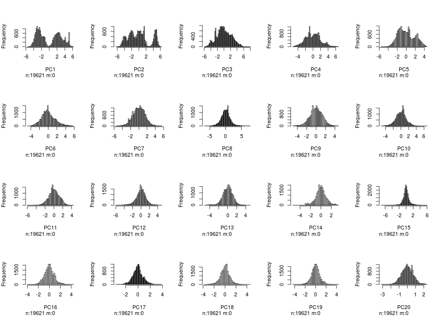

```{r, echo=F, message=F}
library(caret)
library(lubridate)
library(tidyr)
library(ggplot2)
library(dplyr)

pml_write_files = function(x){
    n = length(x)
    for(i in 1:n){
        filename = paste0("test_predictions/problem_id_",i,".txt")
        write.table(x[i],file=filename,quote=FALSE,row.names=FALSE,col.names=FALSE)
    }
}
```

### Introduction
Activity recognition is a growing field of research as wearable accelerometers have become smaller
and cheaper. As a result there is a large amount of biomechanical data quantifying human movement.
A weight lifting dataset, found here http://groupware.les.inf.puc-rio.br/har, provides belt-generated
accelerometer worn by people who were instructed to lift weights properly and improperly. The 
"correctness" of each lift was ranked A, B, C, D, and E (desecnding correctness) and the objective is
to build a predictive model to correctly classify lifts. 

This report will outline all the steps used during preprocessing, training, and evaluation of the 
final predictive model. The resulting random forest has a cross-validated training set accuracy of $.981$
$(95\%\ CI:\ [.975, .987])$, out-of-bag training accuracy of $.983$, and a test set accuracy of 1.

### Exploratory Analysis and Preprocessing
The training data had several problems that needed to be addressed before being used to properly train
a model. Several issues were fixed through manual inspection and the remainder were taken care of
mathematically. There are a total of 152 features in the raw training data and the steps outlined 
here cut it down to 20 while maintaining the predictive power of the data.

#### Unnecessary columns
There are numerous colums that are unnecessary either due to being metadata or due to having numerous
missing values. The former includes metadata columns, such as participant information and timestamps,
that are assumed to be non-predictive. The latter includes columns that contain numerous (> 95%) $NA$'s
and blank values.

```{r}
raw_train <- read.csv("data/pml-training.csv")
raw_train <- raw_train %>% select(-(X:num_window))

# features with missing / incomplete data that arent marked as NA. in this case, these values
# are represented by an empty string: ""
featureMissing <- sapply(raw_train, function(x) {sum(x == "" & !is.na(x)) / length(x)})
missing_flag <- featureMissing >= .95
train_data <- raw_train[, !missing_flag]

# features that are mostly NA (>=95% NA)
featureSparsity <- sapply(train_data, function(x) { sum(is.na(x)) / length(x)})
na_flag <- featureSparsity >= .95
train_data <- train_data[, !na_flag]
```

#### Outliers
A small set of features, the gyro features, had extremely skewed histograms that suggest they had
1 or 2 outliers. Upon deeper examination it turned out there was one outlying sample, row 5373, that
was removed.

```{r, echo=F}
train_data <- train_data[-5373, ]
```

#### Zero Variance Features, Standardization, and PCA
In this section I clean up the raw training data some more by removing features with near-zero 
variance (non-predictive), center and scale features (0 mean, similar value ranges), and apply 
PCA to reduce the feature set while maintaining the majority (90%) of the variance. In this case,
scaling the data is very important as the raw data contains features with varying magnitudes. 
```{r, message=F}
train_y <- train_data %>% select(classe)
train_X <- train_data %>% select(-classe)
input_features <- colnames(train_X)

# center and scale all data
standardize_params <- preProcess(train_X, method=c("center", "scale"))
train_X <- predict(standardize_params, train_X)

# now the the data is cleaned up and scaled, we can remove correlated features by using PCA
# keep all principal components required to keep 90% of original variance
pca_params <- preProcess(train_X, method="pca", thresh=.9)
pca_train_X <- predict(pca_params, train_X)
```


The above grid shows the distribution of values of the features in the final training set.
It can be easily seen that all the variables fall in the same range and a vast majority of them 
follow a normal-like distribution. The final training dataset has 19621 rows and 20 features.

### Modelling and Training Evaluation
The training data create above will be used to create and validate a random forest model. 10-fold
cross-validation and out-of-bag error are used to evalulate the model. 
```{r, message=F, cache=T}
library(doParallel) 
registerDoParallel(cores=4)     # use 4 threads to train model
set.seed(12345)                 # constant seed for randomness

K = 10
pca_train_data <- cbind(pca_train_X, train_y)
ctrl <- trainControl(method="cv", number=K, classProbs = T, allowParallel = T)      # 10 folds
ctrl2 <- trainControl(method="oob", classProbs = T, allowParallel = T)              # out of bag
rf_model <- train(classe ~ ., data=pca_train_data, trControl=ctrl, method="rf")     # build and evaluate model
```

### Test Set Evaluation
Here we process the raw test data in the same manner and with the sampe parameters as used on the
raw training data. From there, the trained model is applied to the test data.

### Conclusion