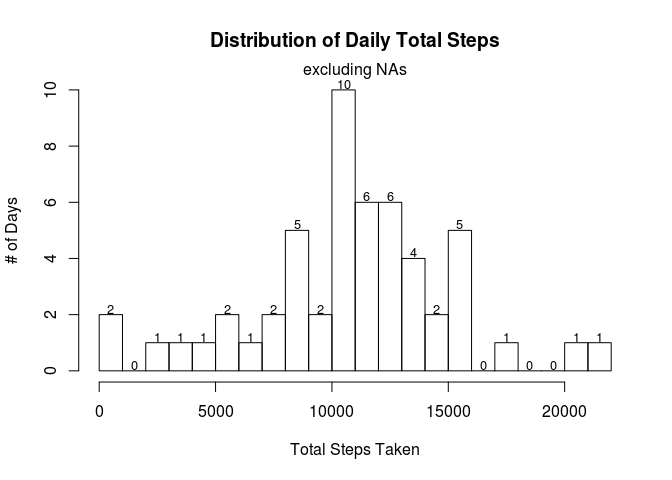
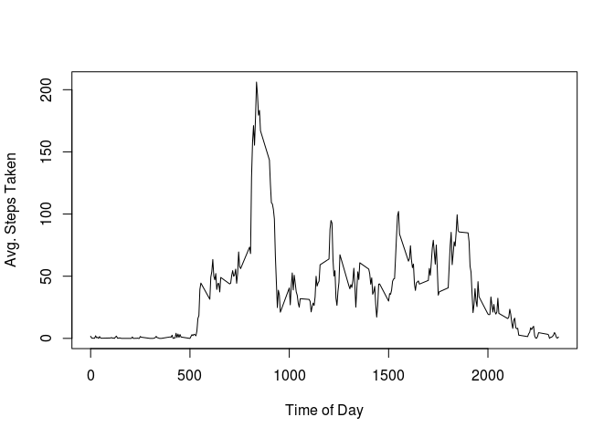
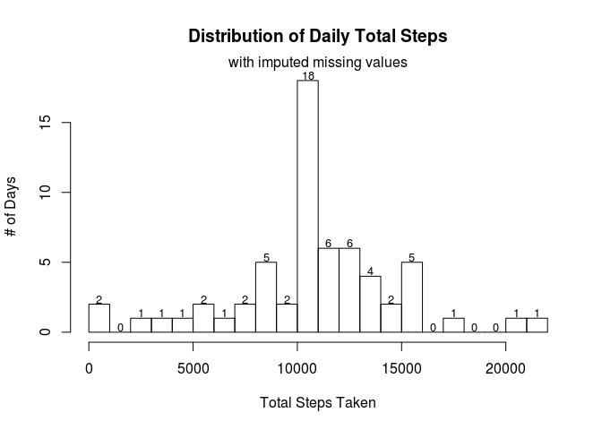
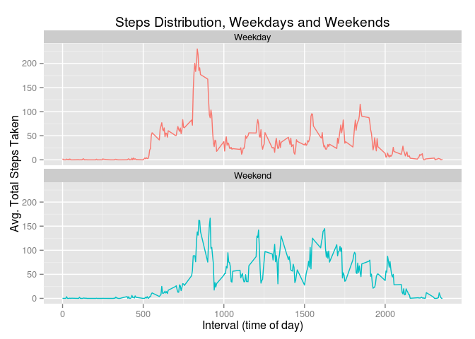

# Reproducible Research: Peer Assessment 1


### Loading and preprocessing the data

```r
library(lubridate)
library(dplyr)
library(ggplot2)

raw_data = read.csv("raw-data/activity.csv")
working_data <- raw_data %>% mutate(date=ymd(date), weekday=wday(date, label=T))
```


### What is mean total number of steps taken per day?

```r
# total steps taken per day ignoring NAs
daily_total_steps <- working_data %>% 
    filter(!is.na(steps)) %>% 
    group_by(date) %>% 
    summarize(total_steps=sum(steps))

# avoid scientific notation used by knitr for printing floating-pt numbers
options(scipen=999)
mean_steps = round(mean(daily_total_steps$total_steps), 3)
median_steps = round(median(daily_total_steps$total_steps), 3)

# histogram of total steps
h = hist(daily_total_steps$total_steps, breaks=20, ylab="# of Days", xlab="Total Steps Taken", 
    main="Distribution of Daily Total Steps")
mtext("excluding NAs")
text(x=h$mids, y=h$counts+.2, labels = h$counts, cex = .8)
```

 

The **mean** daily total steps is 10766.189.

The **median** daily total steps is 10765.


### What is the average daily activity pattern?

```r
# remove NAs, and group data by interval to create a time-series of average step count per 5 minute
# interval.
mean_interval_steps <- working_data %>%
    filter(!is.na(steps)) %>%
    group_by(interval) %>%
    summarize(avg_steps=mean(steps))

# the interval with the highest average step count. 
idx = which.max(mean_interval_steps$avg_steps)
max_interval = mean_interval_steps[idx, ]

plot(x=mean_interval_steps$interval, mean_interval_steps$avg_steps, type="l",
     ylab="Avg. Steps Taken",
     xlab="Time of Day")
```

 

The interval with the **highest average number of steps** is 835 with 
206.17 steps.


### Imputing missing values

```r
# rows with a missing step count
na_steps <- working_data %>% filter(is.na(steps))
```
There are 2304 rows with a missing step value.


```r
# IMPUTATION
# fill NA's with the average for that interval. then massage the dataset back into the original form
imputed_steps <- merge(x = na_steps, y = mean_interval_steps, by.x = 'interval', by.y = 'interval')
filled_steps <- imputed_steps %>% select(avg_steps, date, interval, weekday) %>% rename(steps=avg_steps)

# combine back into original dataset
cleaned_data = rbind_list(
    working_data %>% filter(!is.na(steps))
    , filled_steps
    )

new_daily_total_steps <- cleaned_data %>% 
    group_by(date) %>% 
    summarize(total_steps=sum(steps))
new_mean_steps = round(mean(new_daily_total_steps$total_steps), 3)
new_median_steps = round(median(new_daily_total_steps$total_steps), 3)

# histogram of total steps
h = hist(new_daily_total_steps$total_steps, breaks=20, ylab="# of Days", xlab="Total Steps Taken", 
    main="Distribution of Daily Total Steps")
mtext("with imputed missing values")
text(x=h$mids, y=h$counts+.35, labels = h$counts, cex = .8)
```

 

The **mean** daily total steps of the filled data is 10766.189.

The **median** daily total steps of the filled data is 10766.189.

NAs for each interval were filled in with the average value of all data points from the same interval.
The resulting changes in the mean and median were extremely small with the mean remaining the same
and a slight increase in the median from 10765 to 10766.189. The numbers above
each bar represent the # of days which fall into each bucket and from this we can see that the 
imputed values added more days to the already tallest bucket. This is why the mean and median change
very little.

### Are there differences in activity patterns between weekdays and weekends?

```r
# two groups: data from weekends, and data from weekdays (dataset without NAs)
weekends <- cleaned_data %>% filter(weekday == "Sun" | weekday == "Sat") %>% mutate(daytype="Weekend")
weekdays <- cleaned_data %>% filter(weekday != "Sun" & weekday != "Sat") %>% mutate(daytype="Weekday")
split_data = rbind_list(weekends, weekdays)

# calculate the average total steps per interval per day type
day_mean_interval_steps <- split_data %>%
    group_by(daytype, interval) %>%
    summarize(avg_steps=mean(steps))

# create the graph using ggplot2 to compare steps per interval, weekends vs. weekdays
ggplot(day_mean_interval_steps, aes(x=interval, y=avg_steps, color=daytype)) + 
    geom_line(show_guide=F) + 
    facet_wrap( ~ daytype, nrow=2, ncol=1) +
    xlab("Interval (time of day)") + 
    ylab("Avg. Total Steps Taken") +
    ggtitle("Steps Distribution, Weekdays and Weekends")
```

 
